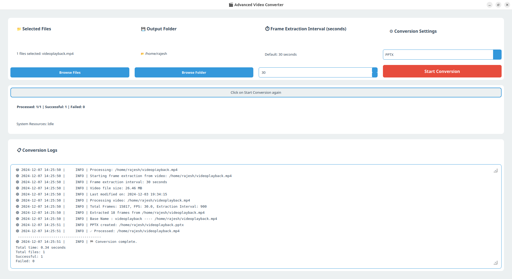

# Video Frame Extractor



## Overview
**Video Frame Extractor** is a Python-based application designed to extract frames from videos at regular intervals and save them into PDF or PPTX files. It provides a simple and efficient way to process videos and generate documents containing key frames for various purposes like presentations, analysis, or documentation.

---

## Features
- **Frame Extraction**: Automatically extracts frames from videos at user-defined intervals.
- **Export Options**: Saves extracted frames into:
  - **PDF**: For easy sharing and printing.
  - **PPTX**: Ideal for creating presentations.
- **Customizable Intervals**: Users can specify the time interval between frames.
- **User-Friendly Interface**: Simple to use with clear options.

---

## Project Structure
```
.
├── app.png                  # Screenshot of the app
├── README.md                # Project documentation
├── requirements.txt         # List of dependencies
├── snapcraft.yaml           # Configuration for packaging (Snap)
└── src/                     # Source code
    ├── app.py               # Main application logic
    ├── __init__.py          # Package initialization
    └── videos_processor.py  # Core processing logic for video frames
```

---

## Prerequisites
Ensure you have the following installed:
- **Python 3.10+**
- Required dependencies listed in `requirements.txt`.

---

## Installation
1. Clone the repository:
   ```bash
   git clone https://github.com/rajeshdhanda/video-frame-extractor.git
   cd video-frame-extractor
   ```
2. Set up a virtual environment (optional but recommended):
   ```bash
   python3 -m venv env
   source env/bin/activate   # On Windows, use `env\Scripts\activate`
   ```
3. Install dependencies:
   ```bash
   pip install -r requirements.txt
   ```

---

## Usage
1. Run the application:
   ```bash
   python src/app.py
   ```
2. Follow the on-screen instructions to:
   - Select a video file.
   - Choose the frame extraction interval.
   - Specify whether to save frames as a **PDF** or **PPTX**.

---

## Packaging
This app includes a `snapcraft.yaml` file for creating a Snap package. To build the package:
1. Install **Snapcraft**:
   ```bash
   sudo apt update
   sudo apt install snapcraft
   ```
2. Build the Snap package:
   ```bash
   snapcraft
   ```

